# Rust勉強会資料

## 目的

~~みんなこの沼に落ちろ~~
Rustの独特な部分をざくっと説明して、入門コストを下げるぞー

### 発表者

@yusuke_ota

---

## 参考文献

* プログラミング言語 Rust, 2nd Edition 日本語訳
    <https://doc.rust-jp.rs/book/second-edition/>
    注: 2018年6月ごろの英語版(Rust2015版)ベースのため内容が少し古い

* 実践Rust入門
    Rust初心者向けの入門書(**内容がすごく重い**)
    プログラミング言語 Rust, 2nd Editionの次に読むと良い

---

## 目次

### ざっくりRust

* Rustの特徴(3分)
* 変数(12分)
* 型
* 所有権
* ライフタイム
* 基本構文
* エラー処理
* 構造体(struct)

---

### (希望があれば)プラスα

* パッケージマネージャーCargo(使って慣れよう)
* 並列,並行,非同期
* 用語説明 (途中まで)
* FFI (間に合わない)

---

## Rustの特徴 1

### メリット

* GCがないから、速い
* GCがないから、OSが無くても動く
* データ競合がないから並列処理が安心して書ける
* FFIでRubyから簡単に呼べる

---

## Rustの特徴 2

### デメリット

* 所有権って何?(独自の概念)
* クラスのがない(structにメソッドを追加していく)
* (オブジェクト指向の人は) 関数型
* async関連(not並列、並行)が未成熟

---

## 変数

### 変数 結論

Rustの変数は基本再代入不可
再代入するには2つの方法がある

1. 可変変数として宣言する
2. 同じ名前の別の変数を新規作成する

---

### 変数 in Rust

Rustでは変数のことを
**変数束縛**と呼ぶ

---

### ミュータブル？イミュータブル？

Rustの変数は以下の様に宣言
しかし、コメントアウト部分でエラーがおきる

```rust
fn main(){
    let value = "変数1";

    // コンパイルエラー
    // value = "変数2";
}
```

[Rust Playground](https://play.rust-lang.org/?version=stable&mode=debug&edition=2018&gist=9038c11efd6b7cf7060d32b1ce149fc2)

---

### なぜなのか？

Rustの変数は基本**イミュータブル(変更不可)**

---

### どうしたらよいか？

1. ミュータブル(変更可能)な変数として宣言する
2. 再定義する(シャドーイング)

---

#### 1. ミュータブル(変更可能)な変数として宣言する

```rust
fn main(){
    let mut value = "変数1";
    value = "変数2";

    // コンパイルエラー
    // "変数2"は&str型、2.0はf64型で型が違う
    // value = 2.0_f64;
}
```

[Rust Playground](https://play.rust-lang.org/?version=stable&mode=debug&edition=2018&gist=31a5fc47dd3ff9252bc517c371518b9e)

---

#### 2. 再定義する(シャドーイング)

```rust
fn main(){
    let value = "変数1";
    let value = "変数2";

    // OK
    // valueをf64型として新規作成
    let value = 1.0_f64;
}
```

[Rust Playground](https://play.rust-lang.org/?version=stable&mode=debug&edition=2018&gist=0c8929defa97460ec4c13963bc461809)

---

### どんな違いがあるのか

* ミュータブル mut
  変数の値を書き換える

* シャドーイング let
  同名の別の変数を作成する

---

#### ミュータブル mut 1

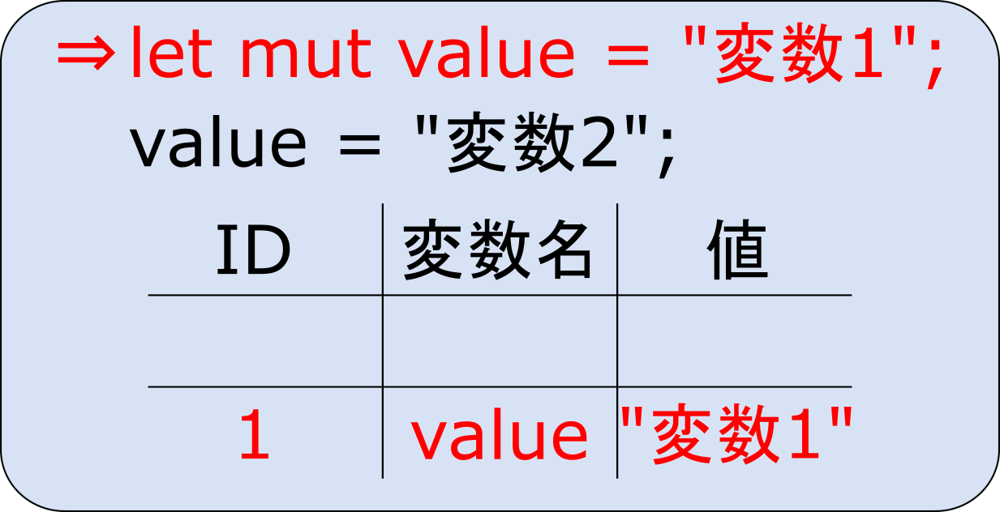

---

#### ミュータブル mut 2

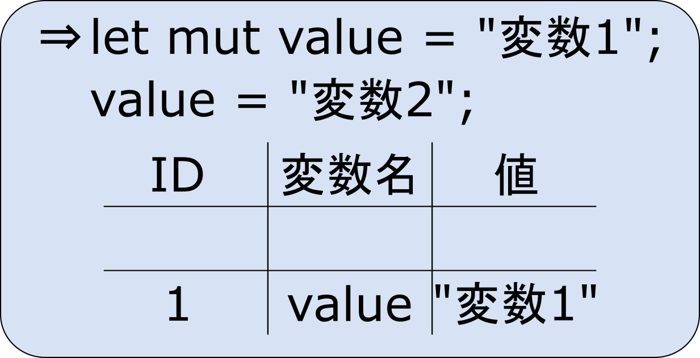

---

#### ミュータブル mut 3


---

#### シャドーイング let 1

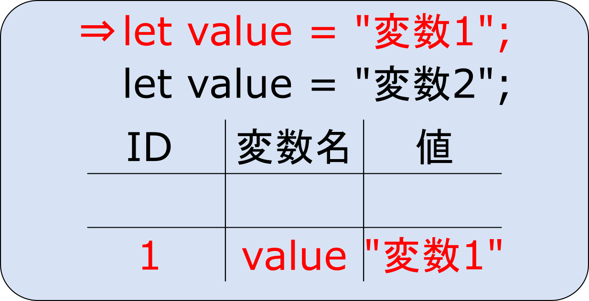

---

#### シャドーイング let 2

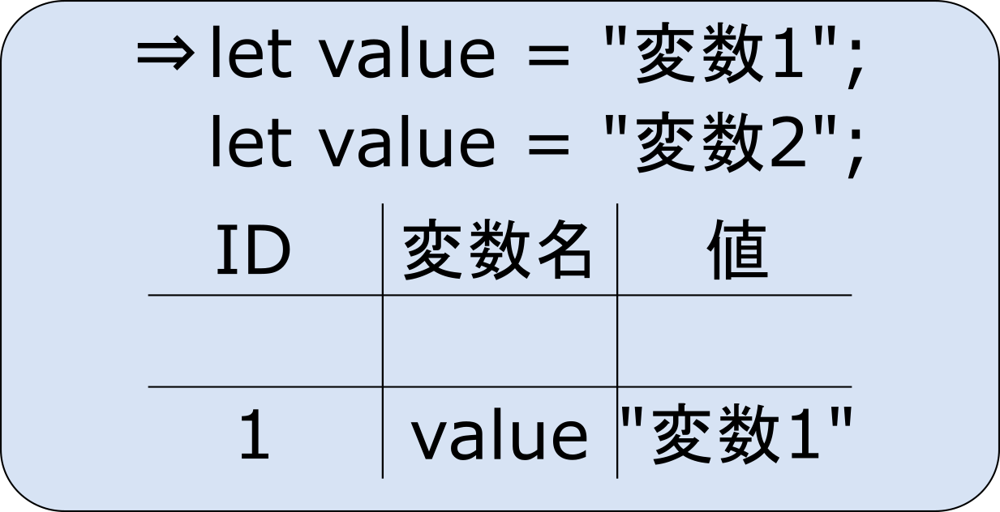

---

#### シャドーイング let 3

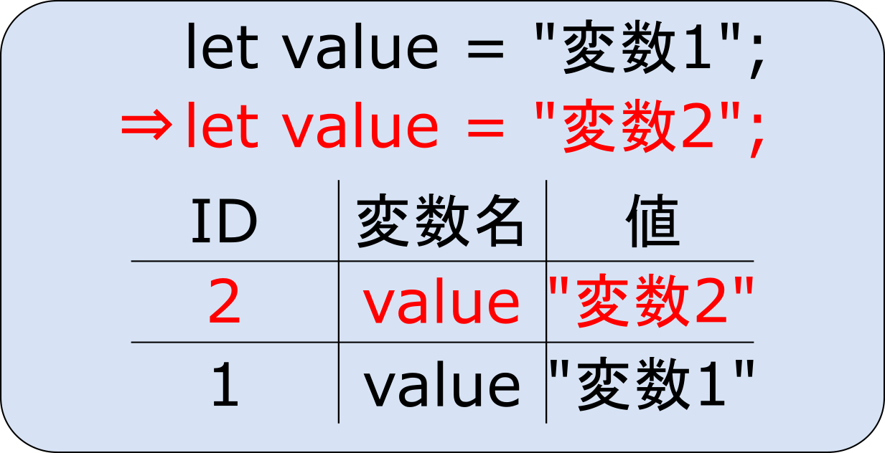

---

#### どんな違いがあるのか(コード)

[代入とシャドーイングを行う](https://play.rust-lang.org/?version=stable&mode=debug&edition=2018&gist=413eae0e9edfd05b7732eb1a99d79e0a)

[ポインタから見る動作の違い](https://play.rust-lang.org/?version=stable&mode=debug&edition=2018&gist=352946a094ed832632594292c6aa31d8)

---

### 変数 演習

[Runが通るように修正しましょう](https://play.rust-lang.org/?version=stable&mode=debug&edition=2018&gist=1562d909fa6bab7d338289c1139729bb)

目標5分

<!-- 10分 + 5分 -->

---

## 型

### 型 結論

Rustは型によって変数作成時の動きが違う

1. **固定長型**の変数はメモリの**スタック**領域に作成 (整数型や、固定長文字列など)
2. **可変長型**の変数はメモリの**ヒープ**領域に作成 (可変長文字列や可変長配列など)

---

### 一覧(固定長？可変長？)

固定長(値型)と可変長の配列(参照型)でメモリの使い方が違う
-> **代入時の動作が違う**

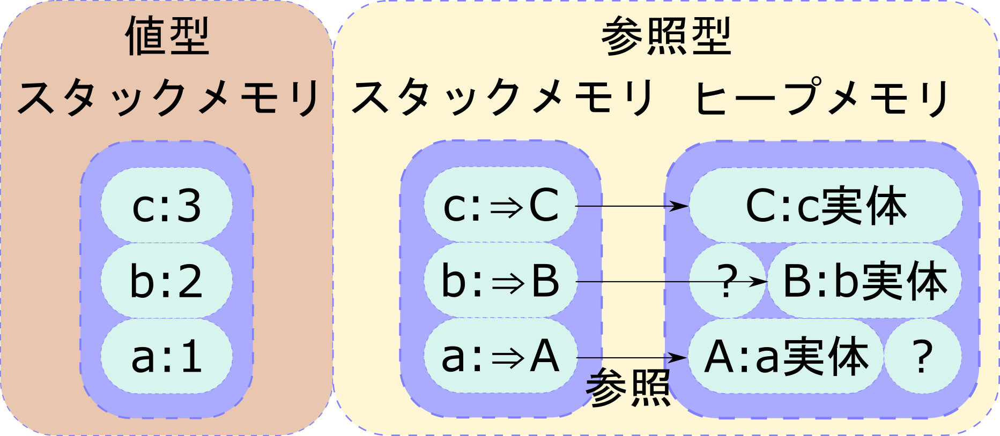

---

#### 固定長1 数値

|bit数              |整数   |符号なし整数|浮動小数|
|:--:               |:--:   |:--:       |:--:   |
|8bit               |i8     |u8         |f8     |
|16bit              |i16    |u16        |f16    |
|32bit              |**i32**|u32        |f32    |
|64bit              |i64    |u64        |**f64**|
|128bit             |i128   |u128       |無し   |
|アーキテクチャ依存   |isize |usize     |無し   |

整数型はi32、浮動小数点型はf64推奨
出典：[プログラミング言語 Rust, 2nd Edition データ型](https://doc.rust-jp.rs/book/second-edition/ch03-02-data-types.html)

---

#### 固定長2 論理値型、文字型、タプル型、配列型

|型名   |記号   |備考                                                   |
|:--:   |:--:   |:--:                                                   |
|論理値型|bool  |true, false                                            |
|文字型 |char   |ユニコードスカラー値 (U+0000~U+D7FF, U+E000~U+10FFFF)  |
|タプル型|( )   |複数の型を設定可 ex: (a:i32, b: f64, c: bool)          |
|配列型 |[T;N]    |初期化時の配列の長さから変更不可(固定長配列)         |

---

#### 可変長の配列

|型名   |記号   |備考              |
|:--:   |:--:   |:--:              |
|文字列 |String |可変長の文字列    |
|配列型 |Vec<T>  |可変長の配列     |
|スマートポインタ|省略      |省略  |

---

※注：書き方は似てるが`Vec<T>`型(可変長)と`[T;N]`型(固定長)は違う

```rust
fn main(){
    // 固定長
    let mut fixed_vector = [1,2,3,4,5];
    fixed_vector[2] = 0;
    assert_eq!(fixed_vector, [1,2,0,4,5]);
    // error: fixed_vectorはpush()が実装されてない(固定長)
    // fixed_vector.push(6);
}
```

```rust
fn main(){
    // 可変長
    let mut variable_vector = vec![1,2,3,4,5];
    variable_vector[2] = 0;
    variable_vector.push(6);
    assert_eq!(variable_vector, [1,2,0,4,5,6]);
}
```

---

### 型エイリアス

Rustでは型に好きな名前をつけることができる
すごく長い型になったときに使うと良さげ

```rust
type Vector2 = (i32, i32);

fn main(){
    let tap = (2,2);
    let vec: Vector2 = (2,2);
    assert_eq!(tap, vec);
}
```

---

## 所有権システム

### 所有権システム 結論

所有権システムの働き

* 不正な値の変数を許さない (解放済みの変数、値の入っていない変数etc.)
* 変数の整合性を保証するため、ロックをかける ~~(DBかよ)~~

---

### 詳細説明

の前に、Rustでのunsafeについて

---

### Rustでのunsafe

以下の実装を行う場合にはunsafeブロックで囲む必要がある

* **生ポインタを参照外しする**
  生ポインタ: Cでいうポインタ、メモリのアドレスを表す
  参照外し: ポインタの参照先の値を直接読み取ること
* **可変のグローバル変数にアクセスしたり変更する**
* unsafeな関数やメソッドを呼ぶ
* unsafeなトレイトを実装する
  トレイト: Rustで使う、インターフェースみたいなもの

---

### つまり

Rustは

* 中身の保証されていないポインタの参照外し
* 無秩序なデータ書き換え

がunsafeだと考えている。

そのための**所有権システム**

(メモリリークは仕方がない…)

---

### 所有権 大まかな考え方

(ざっくり)
所有権は変数の未定義動作やデータの競合を防ぐ仕組み
権利のある変数しか、値にアクセスできない

(メモリ解放にも関係するが、ここでは割愛)

---

### 所有権

既存の変数を他の変数に代入したとき
**固定長**か**可変長**かで動作が変わる

```rust
fn main(){
    let fixed_array = [0,1,2,3,4]; // [i32; 5]型は固定長(= 変数はスタック領域)
    let array = fixed_array;
    assert_eq!(fixed_array, array); // OK: fixed_arrayはarrayにコピーされる
}
```

```rust
fn main(){
    let variable_array = vec![0,1,2,3,4]; // Vec<i32>型は可変長(= 変数の本体はヒープ領域)
    let array = variable_array;
    // compile error: variable_arrayの中身はarrayに移される
    // assert_eq!(variable_array, array);
}
```

---

#### 図解 コピーセマンティクス

コードを書いている時点で、どのくらいメモリを使うかわかる
-> 変数の中身(値)をコピーする際のコストがわかる
-> 値がコピーされる

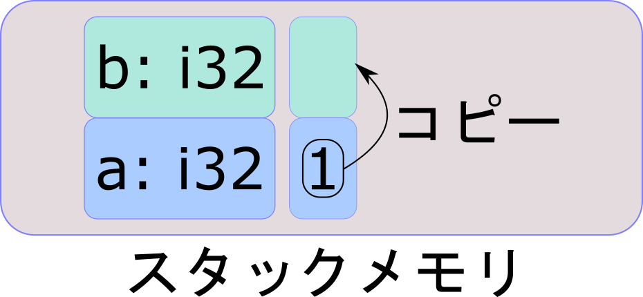

---

#### 図解 ムーブセマンティクス

コードを書いている時点で、どのくらいメモリを使うかわからない
-> その変数の中身(値)が動画だったら、コピーに時間がかかる
-> ヒープのアドレスがコピーされる(シャローコピー)
-> 参照カウンターは管理コストがかかるから、コピー元は使用禁止

ヒープ： ムーブ(move)

---

##### メモリ開放

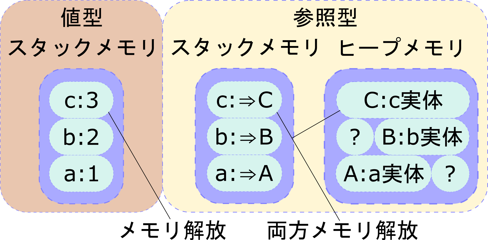

---

##### 同時参照

参照カウンターが必要(一般的な言語はGCで用意している)
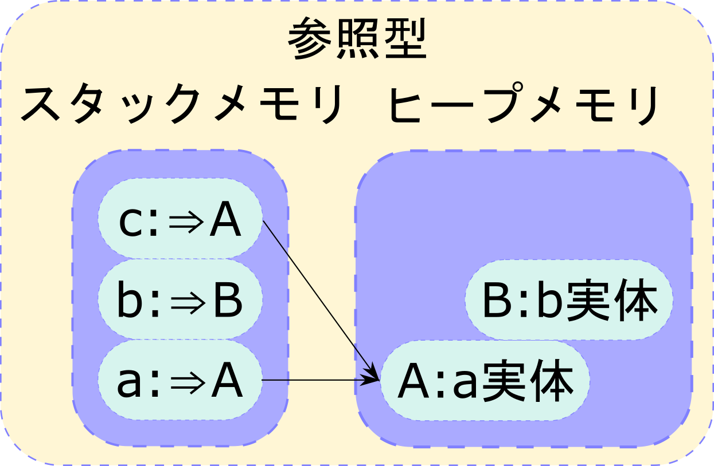

---

#### ムーブ

古い方の変数を使えなくすれば問題ない
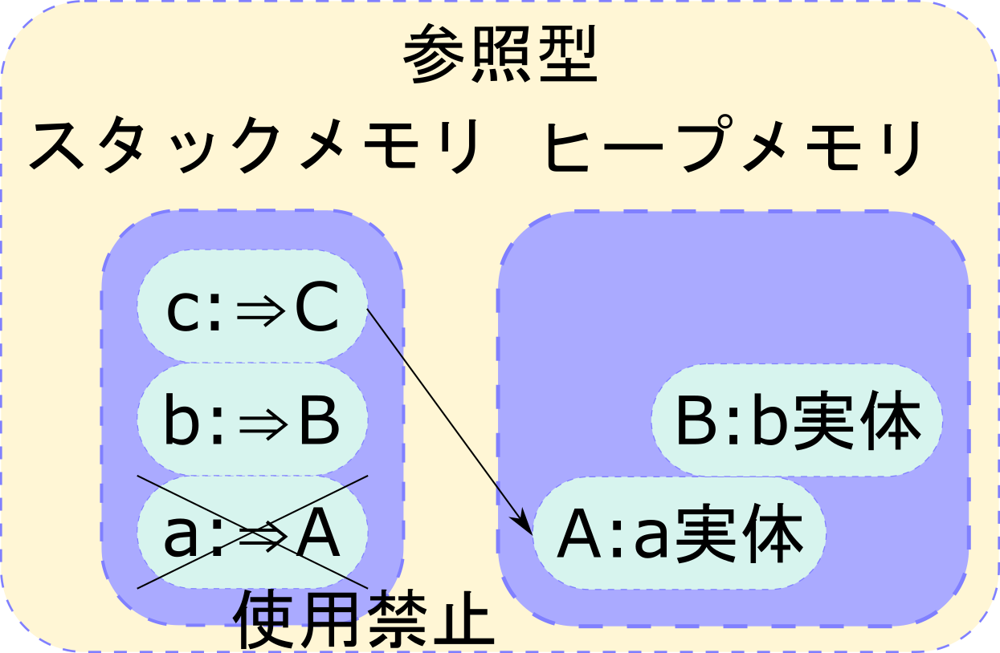

---

#### 図解 ムーブセマンティクスまとめ

一つのヒープ上の値に対して、
複数のスタック上の変数を割り当てることはできない。
Rustは変数と値が**常に1:1対応**

[所有権で解放後の変数へのアクセスを制限している](https://play.rust-lang.org/?version=stable&mode=debug&edition=2018&gist=99c3f2da10dbca4c3c7cf1c7d97491b0)

---

#### つらい

**参照型を代入するたびに、ムーブ**されるのはつらい
そもそも、**値型のコピーはバグの元**(特にRust以外の言語で)

```rust
fn main(){
    let mut a = 1;
    plus_one(a);
    assert_eq!(a, 1); // aの値は変わらない
}

fn plus_one(mut input: i32){ // aとは別のinputが生成される
    input += 1 // inputの値が変わってもaには何の影響もない
}
```

[Rust Playground](https://play.rust-lang.org/?version=stable&mode=debug&edition=2018&gist=c5a4627e395928b142f47bf931cebc80)

---

#### (つらい)C#で書くとこう

```csharp
using System;
public class C {
    public static void Main() {
        var num = 1;
        PlusOne(num);
        Console.WriteLine(num); // => 1
    }
    static void PlusOne(int input){ // ここでinputにコピーされる
        input += 1;
    }
}
```

[Sharp Lab](https://sharplab.io/#v2:EYLgxg9gTgpgtADwGwBYA0AXEUCuA7NAExAGoAfAAQCYBGAWACgKBmAAmtYGFWBvR1geypVe/QeIBuAQyis8OALasAvKxoBuMeIEAFADY4AzgHk8MABTyFASk0NtgijQCclxba2sAvp4AOUAEtpDBh2GiR2FFZ9I1MLALwMVgTfHAxrPnsHZLxUpJJVDU8fBhKgA)

---

### 参照

≒ 読み取り専用のアクセス権

読み取りだけなら、いくらでも作れる
(書き込みが無いなら、データ競合は考えなくても良い)

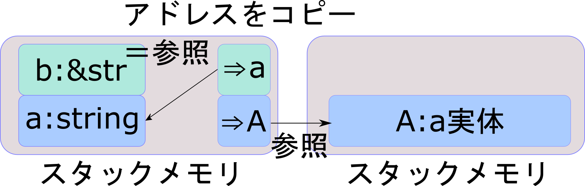

---

### 可変の参照(mut)

≒ 読み書き可能なアクセス権

書き込みがあるとデータ競合を考えなくてはならない
-> 1人しかアクセスできなければ、データ競合を考えなくて良い
-> 占有ロック(みたいなこと)しよう！

* 2つ以上作れない
* 不変参照が存在する場合は作れない

[不変参照と可変参照は共存不可](https://play.rust-lang.org/?version=stable&mode=debug&edition=2018&gist=ba1b4fa8f92a8c738ea2ba7dcb72b1dd)

---

### (参照)注意

貸し出している状態で、元の所有者が変化を加えられる分けないよね

=> 参照がある場合、**参照を通さない**参照先の変数の変更はできない

```rust
fn main() {
    let mut num = 1;
    let ref_num = &num;
    num = 2;
    // compile error: ref_numが所有権を借りているのに、numを書き換えている
    // println!("{}", ref_num); // ref_numはここまで生きる
}
```

[Rust Playground](https://play.rust-lang.org/?version=stable&mode=debug&edition=2018&gist=213547976ff9977e117d3360326e940e)

---

### 配列の一部参照 スライス型

|型名   |記号   |備考                                    |
|:--:   |:--:   |:--:                                   |
|スライス|[T]  |範囲を表す型、ほとんどの場合&[T]で登場  |
|文字列  |str   |文字列用のスライス、ほとんどの場合&strで登場  |

```rust
fn main(){
    let fixed_array = [0, 1, 2, 3, 4];
    let ref_array_one_three = &fixed_array[1..4]; // 配列の一部を参照
    assert_eq!([1, 2, 3], ref_array_one_three);
}
```

---

#### str型とString型の違いって何？

**String型**
ヒープへの参照と、ヒープ上に確保した文字列(参照先)

**str型**
文字列への範囲付き参照
参照先が別に必要

参照先:
`String`型
UTF-8バイト列`[u8; n]`, `Vec<u8>`
インライン文字列 `"サンプル"`

---

#### 図解str

ざっくりいうと、範囲で参照を取るためのもの

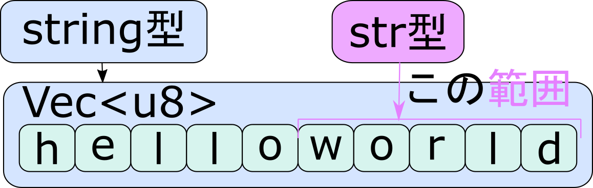

[mut Stringのヒープをstrからいじったらどうなるのか](https://play.rust-lang.org/?version=stable&mode=debug&edition=2018&gist=c1951925718bfe7260f315f706077830)

---

## ライフタイム

参照が参照先(値)より長生きするのを防ぐ仕組み
これが無いと、解放後のメモリにアクセスしてしまう

### 値のライフタイム

所有権を持っている変数のライフタイム = 変数のスコープ

### 参照のライフタイム

参照のライフタイム = 参照が最後に使用されたタイミング

---

### 参照のライフタイムの制限

(参照のライフタイム) <= (参照先のライフタイム)
である必要がある

```rust
fn main(){
    let long_lifetime;
    {
        let short_lifetime = 2;
        long_lifetime = &short_lifetime;
    } // ここでshort_lifetimeか解放される
    // compile error: 解放されたshort_lifetimeにアクセスする
    // println!("{}", long_lifetime);
} // ここでlong_lifetimeか解放される
```

---

### ライフタイム注釈

```rust
// compile error: a,bどちらの参照を返せばいいのかわからない
fn compare_str_lenght(a: &str, b: &str) -> &str{
    if a.len() >= b.len() {
        a
    } else {
        b
    }
}
```

```rust
// OK: <'a>のタグがついた変数(a,b)を返すよ
// ただし、返り値が<'a>より長生きしないようチェックしてね
fn compare_str_lenght<'a>(a: &'a str, b: &'a str) -> &'a str{
    // 省略
}
```

---

### 図解 変数と参照のライフタイム注釈

// TODO: 図の作成

---

### メモリリークはあります

`Rc<T>`や`Arc<T>`で**循環参照**を行うとメモリリークする

Rc: Reference Counted
参照カウンターを実装した型、複数のヒープへの参照が持てる

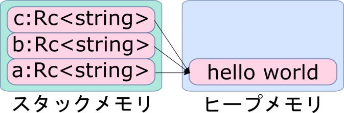

詳しくは[プログラミング言語 Rust, 2nd Edition 日本語訳](https://doc.rust-jp.rs/book/second-edition/ch15-06-reference-cycles.html)

---

## 基本構文

### if

if **bool型** { }

```rust
fn main(){
    let boolen = true;
    if boolen { // bool型(真偽値)のみを取る
        println!("true");
    } else {
        println!("false");
    }
}
```

---

### let if

条件分岐で初期化する値を変えることもできる

```rust
fn main() {
    let boolen = 1 < 0;
    let boolen_str = if boolen {
        "true" // ここと
    } else {
        "false" // ここは同じ型
    };
    assert_eq!("false", boolen_str);
}
```

---

### loop, while

loop {}: 無限ループ
while **bool型** {}: 条件付きループ

```rust
fn main(){
    let mut counter = 1;
    loop {
        println!("this is {}.", counter);
        if counter >= 20 {break;}
        counter += 1;
    }
    while counter < 30 {
        counter += 1;
        println!("this is {}.", counter);
    }
}
```

---

### for, map

```rust
fn main() {
    let valuable_array = vec![0, 1, 2, 3, 4];
    // for
    for value in &valuable_array {
        println!("{}", value);
    }
    // map
    valuable_array.iter().map(move|value| println!("{}", value));
}
```

---

## エラー処理

### panic!

プログラムを異常終了させるためのマクロ

```rust
fn main(){
    print!("hello");
    panic!();
    print!("world"); // ここにはたどり着けない
}
```

[Rust Playground](https://play.rust-lang.org/?version=stable&mode=debug&edition=2018&gist=99f97f587da0ca0f9f5f87f3de4cc655)

---

### Result型、Option型

[Result型](https://doc.rust-lang.org/std/result/enum.Result.html): エラーになりうる結果を返す時に使う

```rust
pub enum Result<T, E> {
    Ok(T),
    Err(E),
}
```

[Option型](https://doc.rust-lang.org/std/option/enum.Option.html): 他言語で言う、Nullになりうる結果を返す時に使う

```rust
pub enum Option<T> {
    None,
    Some(T),
}
```

---

### パターンマッチ

Result型やOption型はそのままでは使えない
パターンマッチで、中身を取り出す
よく例で使われるunwrap()は非推奨

```rust
use std::convert::TryFrom;
fn main(){
    let value = u32::try_from(-1); // キャストは失敗するかもしれないのでResult型
    match value{
        Ok(x) => println!("{}", x),
        Err(_) => println!("_:闇に飲まれよ"),
    }
}
```

[Rust Playground](https://play.rust-lang.org/?version=stable&mode=debug&edition=2018&gist=227c23cf9f037e677d674c519f18e166)

---

## 構造体(struct)

### 構造体(struct) 結論

* 構造体≒変数のみクラス
* 構造体にメソッドを組み込んでクラスの代わりにする
* インターフェースも使える

---

### 構造体って何？

(ざっくり)メソッドが持てない、**変数だけのクラス**

```rust
// rust
struct Vector2 {
    x: f64,
    y: f64,
}
```

```ruby
# ruby
class Vector2 {
    @x
    @y
}
```

---

### お前のメソッド実装はおかしい

値(構造体)に関数を実装する

**基本形**

```rust
struct StructA { /* 構造体 */ }

impl TraitA for StructA{
    fn function_a() { /* 関数 */ }
}

impl TraitB for StructA{ // 複数のトレイトを組み込むことも可
    fn function_b() { /* 関数 */ }
    fn function_c() { /* 関数 */ }
}
```

---

### new、halfメソッド実装例

```rust
struct Vector2 { x:f64, y:f64 }
impl Vector2 { // Vector2に実装する
    // 別にメソッド名はnewでなくても良い buildでもhogehogeでも
    fn new(x_pos: f64, y_pos: f64) -> Self{
        Self { x: x_pos, y: y_pos, }
    }

    // 各要素を半分にする
    fn half(&mut self) {
        self.x /= 2.0;
        self.y /= 2.0;
    }
}
```

[Rust Playground](https://play.rust-lang.org/?version=stable&mode=debug&edition=2018&gist=3eacd02f192c8c6b3d942c6bd1c47123)

---

### Selfとselfって何が違うの?

Selfは型、selfは変数(メソッドの対象)

C#で例えると

```C#
// C#のHttpClientの宣言
HttpClient httpClient = new HttpClient();
    ↑Self       ↑self    ↑ HtmlClient::new()
```

---

### トレイト≒インターフェース

```rust
struct Vector2{x: f64, y: f64}
struct Circle{r: f64}

trait AreaCalculable{
    fn calc_area(&self) -> f64;
}

impl AreaCalculable for Vector2 {
    fn calc_area(&self) -> f64 {
        &self.x * &self.y
    }
}
impl AreaCalculable for Circle {// 省略
```

[Rust Playground](https://play.rust-lang.org/?version=stable&mode=debug&edition=2018&gist=79688fcc8d8d56423cd074e6a3110612)

---

## パッケージマネージャーCargo

ざっくりいうと、

* パッケージマネージャー
* ビルドツール
* テストツール

がまとまったもの。
もちろんGitもついてくる。

---

## 並列,並行,非同期

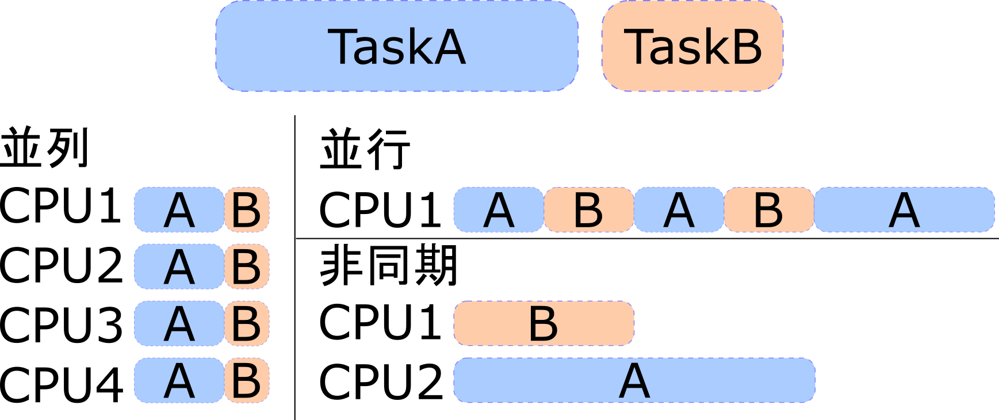

---

### 並列と並行の境

並列処理が並行処理になる境
論理プロセッサー数 < スレッド数

並列処理ライブラリRayonとか良さげ

---

### 並列、並行処理

```rust
use std::thread;
fn main(){
    let vec4 = vec![0, 1, 2, 3];
    let parallel_handle = thread::spawn(move || { // vec4がmoveする
        println!("{:?}", vec4);
        vec4 // vec4を返さないとこのスレッド内でvec4が解放される
    });
    // ここでスレッドから帰ってきたvec4の所有権を受け取る
    match parallel_handle.join(){ // .join()でスレッドの終了を待つ
        Ok(vec4) => println!("{:?}", vec4), // 無事、中身を取り出すことができる
        Err(e) => println!("{:?}", e), // スレッド内でエラーが起こることもある
    };
}
```

1スレッドやんけ

---

### 非同期処理

非同期処理のランタイムのデファクトスタンダードはまだない
(tokio vs async-std)

tokio: 非同期で現在よく使われている(らしい)
async-std: stdをそのまま置き換えられる(らしい) 開発中

---

#### async-stdサンプル

```rust
use std::time::Duration;
use async_std::task; // async-std = {version = "1.5.0", features = ["attributes"]}
#[async_std::main]
async fn main() {
    let handle = count_up_async(1);
    let handle2 = count_up_async(2);
    // println!("{}", handle.await); // handler駆動開始 1:1モデル
    // println!("{}", handle2.await); // handler2駆動開始 1:1モデル
    futures::join!(handle, handle2); // 並行駆動開始 n:1モデル
    println!("Main thread finish!");
}
async fn count_up_async(sleep_time: u64) -> String {
    for counter in 1..10{
        println!("counter is {} {:?}", counter, task::current().id());
        task::sleep(Duration::from_secs(sleep_time)).await;
    }
    "Finish".to_string()
}
```

---

#### 今度こそ非同期処理

```rust
/* 省略 */
async fn count_up_async(sleep_time: u64) -> String {
    let mut async_tasks = vec![];
    for counter in 1..10{
        async_tasks.push(
            task::spawn(async move {
                println!("counter is {} {:?}", counter, task::current().id());
                task::sleep(Duration::from_secs(sleep_time)).await;
            }));
    }
    for async_task in async_tasks { async_task.await };
    "Finish".to_string()
}
```

[全文 注:Rust Playgroundは非同期の実行に向いていません](https://play.rust-lang.org/?version=stable&mode=debug&edition=2018&gist=18a45aa264cf33dea6fdf0a0ce93e96d)

---

#### threadを使った非同期処理でお茶を濁す

```rust
use std::thread;
use std::time::Duration;
fn main(){
    // 別スレッドに処理を丸投げ = 非同期
    let handle = thread::spawn(||{
        println!("sub thread");
        let sub_thread_result = count_up(1);
        sub_thread_result // 返り値
    });
    // 上とほぼ同じ内容
    println!("main thread");
    println!("main thread: {}", count_up(2));
    // 別スレッドの結果取得
    println!("sub thread: {}", handle.join().unwrap_or("その時不思議なことが起こった".to_string()));
}
fn count_up(sleep_time: u64) -> String {
    for counter in 1..5{
        println ! ("counter is {}. {:?}", counter, thread::current().id());
        thread::sleep(Duration::from_secs(sleep_time));
    }
    "Finish".to_string()
}
```

---

### スレッド間のデータ共有

[Arc<Mutex<T>>](https://doc.rust-jp.rs/book/second-edition/ch16-03-shared-state.html), [mpsc](https://doc.rust-jp.rs/book/second-edition/ch16-02-message-passing.html)を使う

[Arc<Mutex<T>>サンプル](https://play.rust-lang.org/?version=stable&mode=debug&edition=2018&gist=d85c0ef94824f8ae4f8561568408e64e)

[mpscサンプル](TODO: コード作成)

---

#### アトミック性

Arc: Atomic Reference Counted

データの書き換え途中が外部から観測されない
書き換え工程は オールorナッシング

---

### データ競合

Rustでは**起きない**

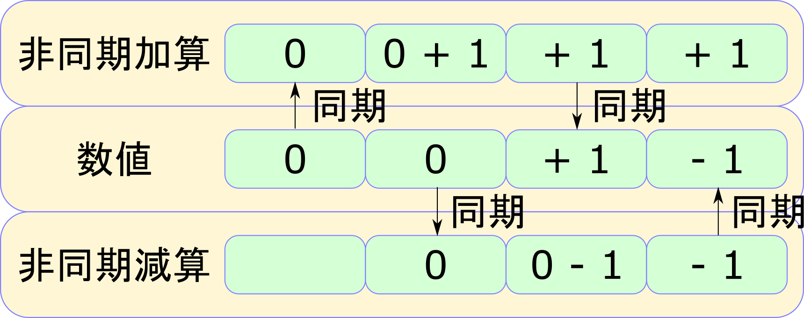

---

### デッドロック

Mutexを使用するとデッドロックを起こすことがある

```rust
use std::sync::{Arc, Mutex};
use std::thread;
fn main(){
    let lock = Arc::new(Mutex::new("中身"));
    let share_lock = Arc::clone(&lock); // Mutex("中身")への参照をコピー
    let message = lock.lock().unwrap(); // messageが"中身"を取得、ロックをかける

    let handle = thread::spawn(move ||{println!("{}", *share_lock.lock().unwrap())});
    println!("{}", *message);
    handle.join().unwrap(); // messageが"中身"を占有中なので、処理できない
} // messageが"中身"を手放す、ロックが外れる
```

参考:[kubo39's blog Rustのlockとスコープのはなし](https://kubo39.hatenablog.com/entry/2017/05/13/Rust%E3%81%AElock%E3%81%A8%E3%82%B9%E3%82%B3%E3%83%BC%E3%83%97%E3%81%AE%E3%81%AF%E3%81%AA%E3%81%97)

---

## 用語説明(in Rust)

### 変数関係

* 変数束縛
    他の言語でいうところの変数
    基本はイミュータブルである
* イミュータブル
    変更不可な変数 ≒ 他の言語の`ReadOnly`
    `const`とは別物(`const`はインライン化される)
* ミュータブル
    変更可能な変数
    `let mut`で宣言する
* シャドーイング

---

### 型関係

* 値型
    変数束縛が直接値を持っている型
    スタックメモリに値が格納されている
* 参照型
    変数束縛がヒープメモリ上の実体への参照を持っている型
    実体はヒープメモリに格納されている
* プリミティブ型
    Rustが本体で提供している機能([stdクレート](https://doc.rust-lang.org/std/index.html)の[プリミティブ型](https://doc.rust-lang.org/std/index.html#primitives))
    ユーザー定義以外の値型が該当する(はず)
    String型等参照型は、プリミティブ型ではない
    (Rust公式が提供しているユーザー定義型)

---

## FFI

FFI: Foreign function interface
他言語から、関数やメソッドを呼び出す機構(Wikipedia)

RubyからFFI経由でRustの関数を呼んだりできる
メリット: 特定の処理をメソッドレベルでRustに置き換えられる

C#はdllimportで呼んで

---

### FFI使い方

関数の前に`#[no_mangle]`をつけて、dllにビルド

```rust
#[no_mangle]
pub extern fn call_rust(){
    println!("this is Rust!!");
}
```

他の言語からdllを介して、同じ関数名で呼べるようになる
詳しくは[こちら](https://doc.rust-jp.rs/the-rust-programming-language-ja/1.6/book/rust-inside-other-languages.html)
